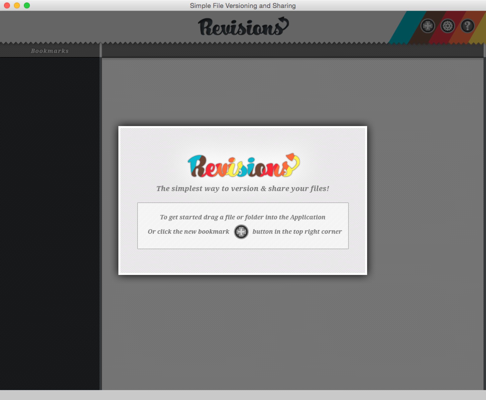

#Revisions

[Revisions](http://revisions.braitsch.io/) is a cross-platform Git client for designers built in Adobe Air. 
**Note: This project is no longer supported and is only on Github for archival purposes.**

##Features

* Create, add, edit and delete repositories via drag and drop interface
* Track individual files as well as directories
* Convenient Github and [Beanstalk](http://beanstalkapp.com/) integration
* Manage your remote repositories and collaborators
* Merge conflict resolution assistant
* Desktop notifications when remote files are updated
* Completely sandboxed from the SSH keys and Git binaries on your system

##History

I designed and developed Revisons over a period of about 10 months in 2011. 
[You can read the full story of how the project came about here.](https://medium.com/@braitsch/failure-under-version-control-9eaffcba4f36)

##Compiling

Revisions compiles into Mac & Windows installers via a series of Ant tasks.  To build the project from source:

* Download and install [FDT](http://fdt.powerflasher.com/) (recommended) or any flavor of the [Eclipse IDE](https://eclipse.org/downloads/)
* [Download version 4.6 of the Flex SDK](http://www.adobe.com/devnet/flex/flex-sdk-download.html)
* Launch FDT and add the project to your workspace via File > Import > General > Add existing project to workspace
* Open build.xml in the project root and set the SDK property at the top of the file to point to the Flex SDK on your machine
* Open the Ant panel if it is not already visible via Window > Show View > Ant
* Drag the build.xml file into the Ant panel and run the "Compile Package and Release" task at the top of the list
* If all goes well a compiled installer will appear in the /release directory

##License
Redistribution or modification of any aspect of this project for commercial purposes is strictly prohibited. Permission for personal use however is hearby granted. If you are interested in using or extending any part of this project for commercial purposes you must contact me for explicit permission.

Copyright (C) 2015 [Stephen Braitsch](http://braitsch.io)
